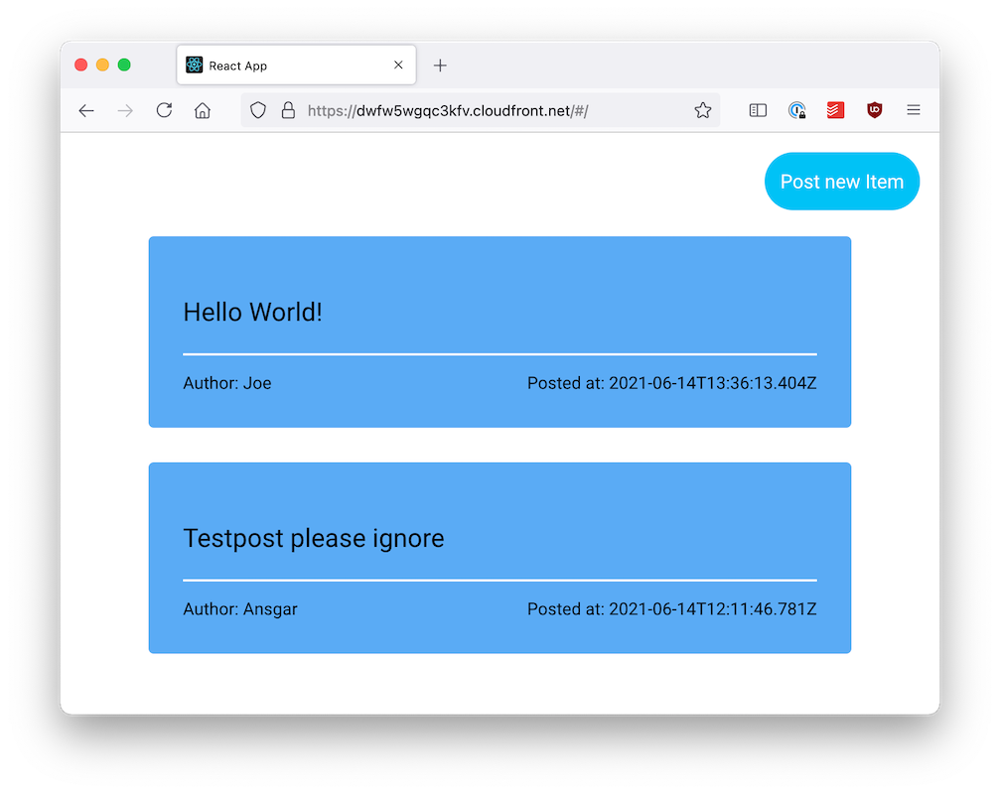
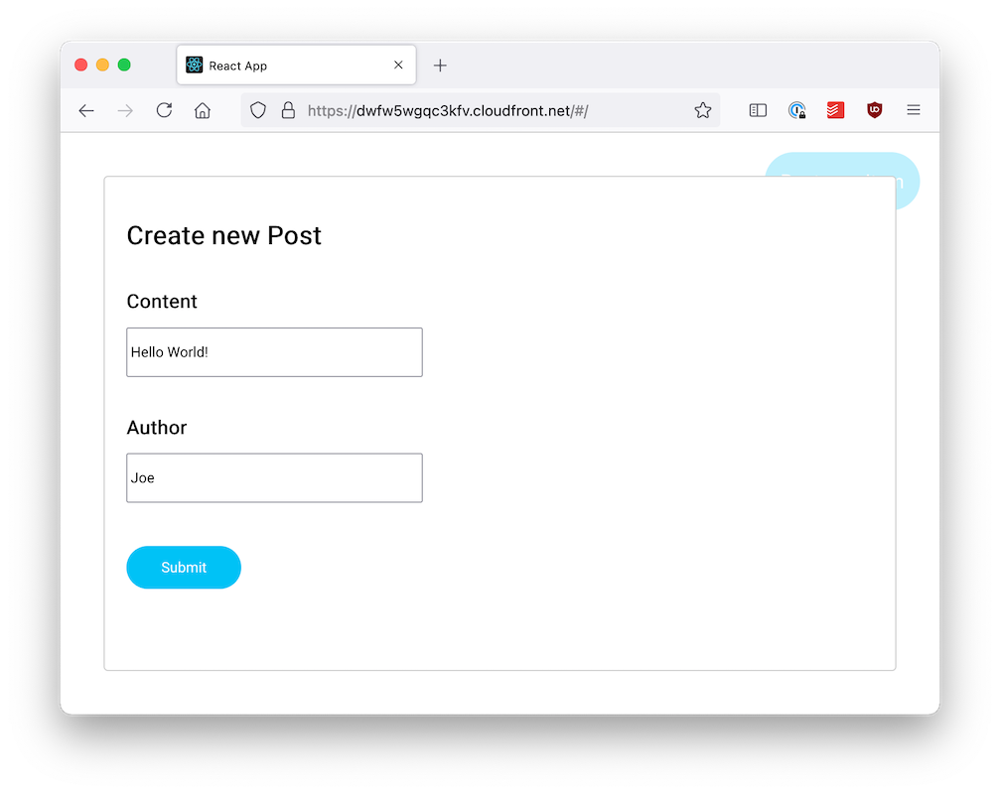

# CDK for Terraform Serverless application example

This repo contains an end to end example in TypeScript for a serverless web application hosted on AWS and deployed with the [CDK for Terraform](https://cdk.tf). Please refer to the [guide](https://github.com/hashicorp/terraform-cdk/blob/main/docs/full-guide/serverless-application-typescript.md) for more information.

### Techstack

Frontend: React, Create React App, statically hosted via AWS S3 + CloudFront  
API: AWS Lambda + API Gateway + DynamoDB

### Application

The example application features a list of posts and a modal to create a new post by specifying author and content.

## Documentation

This application serves as the sample for the "Building a serverless application with the CDK for Terraform" guide which can be found [here](https://github.com/hashicorp/terraform-cdk/blob/main/docs/full-guide/serverless-application-typescript.md).

## Future Features

There are some features we'd like to add to this application over time to cover more common use cases and scenarios that might appear when building applications. As building within the serverless paradigm often makes use of cloud native services, we plan to extend this example to showcase such features and also to cover different cloud providers at some point.  
Besides new features, we also plan to keep this example up-to-date with newer versions of the CDKTF to get rid of workarounds for workflows that get supported by later versions of the CDKTF (e.g. referencing resource outputs in other stacks).

### Ideas

_(in no particular order)_

- [ ] Add a feature that makes use of a CRON job. This will probably be implemented using CloudWatch events for AWS as the "serverless way" of expressing such a feature.
- [ ] Give posts an optional expiration date after which they are deleted (if set). This will probably be implemented using the TTL functionality of DynamoDB (as opposed to a CRON which might have been used for cleanup in a traditional SQL database).
- [ ] Add a Github action to deploy preview builds to a temporary environment.
- [ ] Add tests on different levels (unit, integration, end-to-end, visual)
- [ ] Use an [Aspect](https://github.com/aws/constructs/blob/main/API.md#constructs-iaspect) (Visitor pattern) to set the environment prefix on all resources. Possibly also add a test that checks if all resources are covered (e.g. by using a random string and searching for its occurence in resource attributes).
- [ ] Use [IAM floyd](https://www.npmjs.com/package/iam-floyd) to build IAM policies in a more concise way
- [ ] Check if S3 Bucket could be restricted further. [Related](https://github.com/hashicorp/terraform-cdk/pull/786#issuecomment-864237132)

### Workarounds (required currently)

- cross stack references are defined manually (using Terraform remote state and Terraform outputs)

### Todos (short term)

- todo: extend npm scripts to deploy everything and feature commands to deploy to the different environments
- todo: write more docs about required AWS credentials and what the commands (from npm scripts) do

### Other notes (soon to be converted into issues for CDKTF)

- after renaming an asset, the previous output stays in cdktf.out/.../assets
- allow multiple stacks to be put into a single tf state?
- multiple stacks depedencies / order of deployment
- define dependencies between resources on a construct level without using inputs/outputs for terraform? -> i.e. could automatically add depends_on to resources
- multiple aws providers? (all being synthesized to the same tf stack but come from different constructs?)
- cdktf outputs --json command?
- detect if a "module" (= extends TerraformResource) adds an output that interferes with an existing output?
  -> this will probably fail because of the constructs name but we might want to improve the error message
